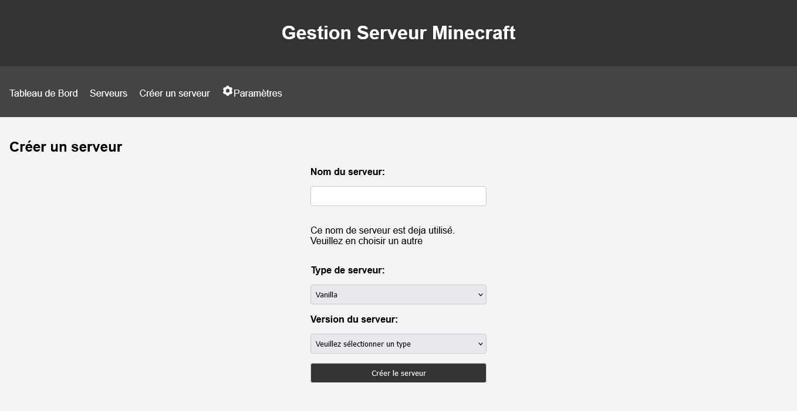
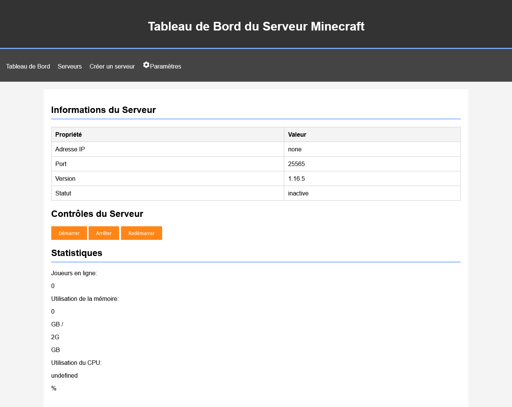

# This project is on pause for the moment due to lack of time, if you want to relaunch it you can contact me I will be delighted to continue to develop it with someone

# Ce projet est en pause pour le moment faute de temps, si vous voulez le relancer vous pouvez me contacter je serai ravi de continuer a le développer avec quelqu’un

### Vous êtes français ? Moi aussi ! [Cliquez ici pour voir la version française](#french-version)
## Summary
- [MineServGUI](#mineservgui)
  - [Features](#features)
  - [Comming soon](#comming-soon)
  - [Installation](#installation)
  - [Screenshots](#screenshots)
  - [License](#license)
    - [This project is licensed under the CC BY-NC-SA 4.0 License - see the [LICENSE](LICENSE) file for details](#this-project-is-licensed-under-the-cc-by-nc-sa-40-license---see-the-licenselicense-file-for-details)
      - [Ajustements of the license :](#ajustements-of-the-license-)
  - [Credits](#credits)

# MineServGUI
A simple GUI for managing a Minecraft server.
## Features
- Darkmode
- Start, stop, and restart the server
- Create server
- Create server with plugins (spigot)
- Create server with mods (forge, fabric)
- Make custom start, install, and stop commands
- Change server properties
- Automatic installation of server
- Eula auto-accept
- Physical server status
- Server status
- French // english translation
- Server deletion
- Remote file access (in progress)

## Comming soon
- Server backups
- Server logs [In progress]
- Server console
- Better UI (maybe)
- Update of 'versions.json' (the file that contains all the versions of the server)
- More server types (like paper, bukkit, etc.) (update of 'versions.json')
- Update of 'commands.json' (the file that contains all the commands for each versions)

## Installation
1. Download the latest release from the [releases page]()
2. Extract the zip file
3. Run the python file [install.py](install.py)
5. Open a web browser and go to `localhost:'port'` (port is the port in [config.conf](config.conf))
6. Enter the user//password you set in the installation
7. Enjoy !

## Screenshots
### Server creation

### Server management


## License
### This project is licensed under the CC BY-NC-SA 4.0 License - see the [LICENSE](LICENSE) file for details 
#### Ajustements of the license :
- The license can be changed to any other license by the author of this project : Lasertie (me)
- If the license is changed, the majors collaborators of this project will be notified and will be alredy mentioned in the license

## Credits
- [Lasertie](https://github.com/Lasertie) - Main developer
- You ? - You can contribute to this project by making a pull request or an issue

# French version

# MineServGUI
Une interface graphique simple pour gérer un serveur Minecraft.
## Fonctionnalités
- Démarrer, arrêter et redémarrer le serveur
- Créer un serveur
- Créer un serveur avec des plugins (spigot)
- Créer un serveur avec des mods (forge, fabric)
- Créer des commandes de démarrage, d'installation et d'arrêt personnalisées
- Changer les propriétés du serveur
- Installation automatique du serveur
- Acceptation automatique de l'Eula
- Statut du serveur physique
- Statut du serveur Minecraft

## Prochainement
- Sauvegardes du serveur
- Logs du serveur
- Console du serveur
- Suppression du serveur
- Meilleure interface utilisateur (peut-être)
- Mise à jour de 'versions.json' (le fichier qui contient toutes les versions du serveur)
- Plus de types de serveurs (comme paper, bukkit, etc.)
- Mise à jour de 'commands.json' (le fichier qui contient toutes les commandes pour chaque version)

## Installation
1. Téléchargez la dernière version depuis la [page des releases]()
2. Extrayez le fichier zip
3. Exécutez le fichier exécutable (Start.bat pour Windows, Start.sh pour Linux)
4. Suivez les instructions dans le terminal
5. Ouvrez un navigateur web et allez à `localhost:'port'` (port est le port que vous avez entré dans le terminal)
6. Profitez !

## Captures d'écran
### Création du serveur

### Gestion du serveur


## License
### Ce projet est sous licence CC BY-NC-SA 4.0 - voir le fichier [LICENSE](LICENSE) pour plus de détails
#### Ajustements de la licence :
- La licence peut être changée pour n'importe quelle autre licence par l'auteur de ce projet : Lasertie (moi)
- Si la licence est changée, les principaux collaborateurs de ce projet seront notifiés et seront déjà mentionnés dans la licence

## Crédits
- [Lasertie](https://github.com/Lasertie) - Développeur principal
- Vous ? - Vous pouvez contribuer à ce projet en faisant une pull request ou un issue
```